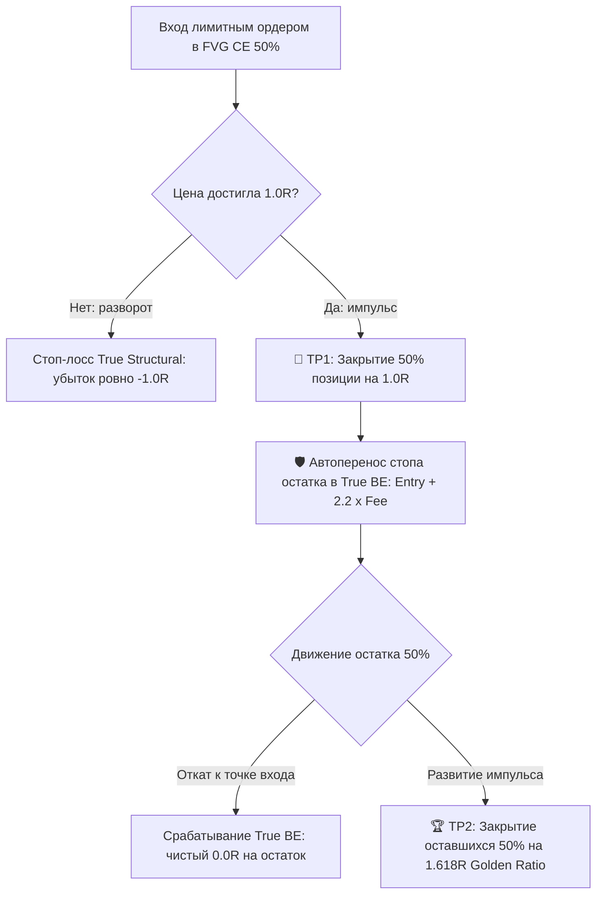

# 🏛️ ICT Toolkit: Единый Институциональный Стандарт Стратегии

> **Статус системы:** В боевой работе (Production Live v3.1)  
> **Рынки:** Bitget USDT-M Фьючерсы (Крипта) & Т-Банк Инвестиции / Мосбиржа TQBR (Акции РФ)  
> **Базовый метод:** ICT Smart Money Concepts (1H Market Bias + 5M Liquidity Sweeps + 1M FVG Consequent Encroachment)  
> **Сетка фиксации (Единая):** Сетка B — 50% на 1.0R (+True BE) ➔ 50% на 1.618R (Golden Ratio)

---

## 1. Сводная матрица единых параметров (Crypto vs MOEX)

Оба рынка переведены на **единую сквозную архитектуру** правил и выходов:

| Параметр / Правило | 🪙 Криптовалюты (Bitget Futures) | 🇷🇺 Акции РФ (Т-Банк / Мосбиржа) | Обоснование и квант-логика |
|---|:---:|:---:|---|
| **Рабочая корзина** | `DOGE, ADA, XRP, BNB, SOL, NEAR` (`--alts`) | `SBER, GAZP, LKOH, ROSN, YDEX` (`--all`) | Высокая ликвидность, доступный шаг лота. Исключены тяжелые контракты BTC/ETH и слабая акция `T`. |
| **Старший таймфрейм (HTF)** | **1H** (60m Bias) | **1H** (60m Bias) | Определение институционального тренда (Market Bias) через BOS / CHoCH. |
| **Младший таймфрейм (LTF)** | **5m** (Sweep & Structure) | **5m** (Sweep & Structure) | Поиск снятия ликвидности (SSL / BSL) и подтверждения слома структуры. |
| **Таймфрейм исполнения** | **1m** (FVG Entry & Fill) | **1m** (FVG Entry & Fill) | Минутный таймфрейм для ювелирного входа в имбаланс (FVG). |
| **Точка входа** | **FVG CE (50% зоны)** | **FVG CE (50% зоны)** | Вход строго посередине FVG. Сокращает стоп на 30–40% и повышает R:R. |
| **Расчет стоп-лосса** | **True Structural Stop** | **True Structural Stop** | Стоп за истинный экстремум между точкой свипа и моментом входа (+0.15% буфер). |
| **Первый тейк (TP1)** | **50% объема на 1.0R** | **50% объема на 1.0R** | Фиксация половины прибыли на 1.0R с немедленным переносом стопа в безубыток. |
| **Защита в безубыток (BE)** | **True BE ($2.2 \times \text{fee}$)** | **True BE ($2.2 \times \text{fee}$)** | Перенос стопа с запасом на комиссии входа/выхода и проскальзывание. |
| **Второй тейк (TP2)** | **50% объема на 1.618R** | **50% объема на 1.618R** | Полное закрытие остатка на математическом истощении волны (Golden Ratio). |
| **Фильтр направления** | **ALL** (Long & Short) | **LONG ONLY** | На акциях РФ шорты убыточны (-4.04R drag, YDEX short -10.68R). Long-Only дает +35.40R. |
| **Фильтр волатильности** | `5m ATR >= 0.05%` & `FVG >= 0.05%` | `5m ATR >= 0.05%` & `FVG >= 0.05%` | «Золотая середина»: отсекает 200 мусорных сделок мертвого боковика. |
| **Фильтр тренда** | 1H ADX >= 20 + Displacement | 1H ADX >= 20 + Displacement | Защита от распила при затухании импульса на HTF. |
| **Календарный фильтр** | **24/7** (Все 7 дней в неделю) | **Исключен Четверг** (`Thursday`) | Четверг на MOEX — день экспираций FORTS (-2.23R убытка). Пн, Вт, Ср, Пт дают PF 2.98. |
| **Сессионное окно** | Круглосуточно | 10:00 – 18:40 МСК (Полный день) | Полная дневная сессия Мосбиржи. Авто-сон ночью и в выходные (Smart Sleep). |
| **Риск на сделку (1R)** | 1.0% депозита (Turbo: до 20%) | 1.0% депозита (~33–100 RUB) | Строгий динамический мани-менеджмент с учетом лотности. |

---

## 2. Годовые результаты бэктестов (1 год, 365 дней, минутная история)

### 2.1. Сводная статистика портфеля (563 сделки в год)

| Рынок / Инструменты | Таймфреймы | Сделок (1 год) | Частота сделок | Winrate (%) | Net R | Profit Factor | Max DD |
|:---|:---:|:---:|:---:|:---:|:---:|:---:|:---:|
| 🪙 **Криптовалюты (Bitget)** | **1H / 5M / 1M** | **439** | ~8.5 сд./нед. | **74.7%** | **+156.01R** 🏆 | **2.26** | **4.10R** 🛡️ |
| 🇷🇺 **Акции РФ (Мосбиржа)** | **1H / 5M / 1M** | **124** | ~2.5 сд./нед. | **74.2%** | **+35.40R** | **2.98** 🏆 | **3.43R** 🛡️ |
| 🏛️ **ИТОГО ВЕСЬ ПОРТФЕЛЬ** | **ЕДИНЫЙ 1H/5M** | **563** | **~11 сд./нед. (~2 в день)** | **74.5%** 💎 | **+191.41R** 💎 | **2.39** | **4.10R** |

> [!IMPORTANT]
> **Почему мы отказались от связки 4H/15m в пользу 1H/5m?**  
> Эксперимент со связкой 4H/15m показал высокий винрейт (81.8%), но дал всего **55 сделок за целый год** (+37.32R). Торгуя 1 раз в неделю, депозит не разгоняется.  
> Рабочая связка **`1H Bias ➔ 5m Sweep ➔ 1m FVG`** при Сетке B генерирует **563 сделки в год** (по 1–2 сделки каждый день), удерживает проверенный винрейт **74.5%** и приносит **+191.41R** (почти в 3 раза больше прибыли)!

---

## 3. Распределение прибыли по дням недели (Day-of-Week Effect)

### 3.1. Криптовалюты (Bitget 24/7, Сетка B):
Все 7 дней недели закрываются в стабильный плюс:
* **Понедельник:** 72 сделки, Winrate 79.2%, Net R +28.98R, PF 2.71
* **Вторник:** 59 сделок, Winrate 74.6%, Net R +21.64R, PF 2.31
* **Среда:** 76 сделок, Winrate 75.0%, Net R +23.14R, PF 2.09
* **Четверг:** 74 сделки, Winrate 77.0%, **Net R +33.99R** (лучший день недели), PF 2.74
* **Пятница:** 68 сделок, Winrate 70.6%, Net R +17.29R, PF 1.79
* **Суббота:** 42 сделки, Winrate 71.4%, Net R +13.89R, PF 2.07
* **Воскресенье:** 48 сделок, Winrate 72.9%, Net R +17.07R, PF 2.15
* **ИТОГО:** **439 сделок, Winrate 74.7%, Net R +156.01R, PF 2.26**. Торговля ведется **все 7 дней**.

### 3.2. Мосбиржа (Т-Банк, Long Only, Сетка B):
* **Понедельник:** 19 сделок, Winrate 84.2%, Net R +6.02R, PF 4.55
* **Вторник:** 29 сделок, Winrate 75.9%, Net R +10.31R, PF 3.83
* **Среда:** 33 сделки, Winrate 69.7%, Net R +7.17R, PF 2.24
* **Четверг (Экспирации FORTS):** 30 сделок, **Winrate 46.7%**, **Net R -2.23R**, PF 0.81 ❌
* **Пятница:** 39 сделок, Winrate 71.8%, Net R +10.87R, PF 2.69
* **БЕЗ ЧЕТВЕРГА (Пн, Вт, Ср, Пт):** **124 сделки, Winrate 74.2%, Net R +35.40R, PF 2.98** 🏆.

---

## 4. Единый механизм сопровождения сделок (Сетка B)



### Формулы уровней:
1. **Тейк 1:** $\text{TP1} = \text{Entry} + 1.0 \times \text{RiskDistance}$ (фиксация 50%).
2. **True Breakeven Стоп:** $\text{BE\_Stop} = \text{Entry} \times (1 + \text{Fee\_Rate} \times 2.2)$ (покрывает двойную комиссию и проскальзывание).
3. **Тейк 2:** $\text{TP2} = \text{Entry} + 1.618 \times \text{RiskDistance}$ (фиксация оставшихся 50%).

---

## 5. Пресеты конфигурации (`config.py`)

1. **`HYBRID_INSTITUTIONAL` (Флагманский рабочий стандарт):**
   * Таймфреймы: **1H Bias ➔ 5m Sweep ➔ 1m FVG Entry (CE)** для обоих рынков.
   * Сетка тейков: **Сетка B (1.0R: 50% + BE, 1.618R: 50%)**.
   * Фильтры: `smc.bos_choch`, Golden Mean волатильности (0.05%), 1H ADX >= 20.
   * Расписание: Крипта 24/7, Мосбиржа Long-Only (Пн, Вт, Ср, Пт).
2. **`POSITIVE_KZ_PLUS_CHOCH`:** Режим с принудительными сессионными Киллзонами.
3. **`PROVEN_CUSTOM_MSS`:** Базовый сетап без внешней библиотеки CHoCH.
4. **`BASELINE_RAW`:** Сырой академический сетап для сравнительного бенчмарка.

---

## 6. Активные команды и продакшн-демоны

В рабочей среде запущены и непрерывно функционируют:

```powershell
# 1. Telegram-бот управления и уведомлений:
.\ict_env\Scripts\python.exe -u telegram_bot.py

# 2. Bitget Крипто-бот (1H Bias / 5m Sweep / 1m FVG CE, Grid B, Real):
.\ict_env\Scripts\python.exe -u live_trade.py --alts --real --yes --htf 1h --ltf 5min --risk 1.0 --max-pos 5

# 3. Т-Банк Мосбиржа бот (1H Bias / 5m Sweep / 1m FVG CE, Long Only, Grid B, Real):
.\ict_env\Scripts\python.exe -u tbank_trade.py --all --real --yes --risk 1.0 --max-pos 5
```

### Команды мониторинга:
* В консоли: `python live_trade.py --stats` и `python tbank_trade.py --stats`
* В Telegram: `/stats` (сводный PnL), `/positions` (открытые позиции), `/levels` (карта ликвидности).
