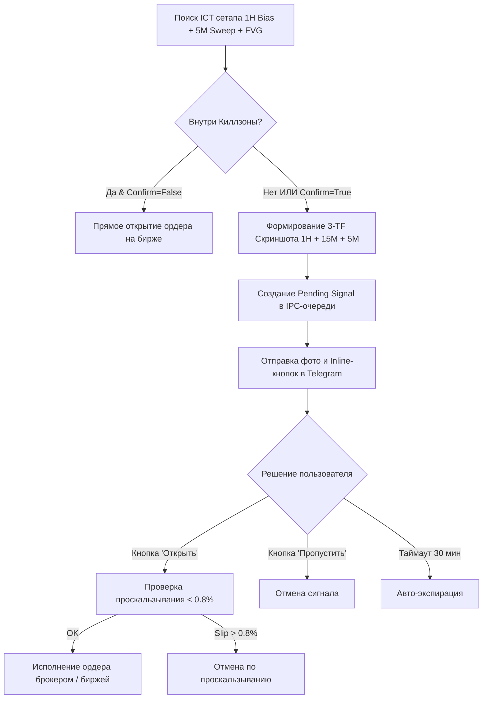

# 🏛️ ICT Toolkit: Сводная матрица параметров, бэктесты и журнал архитектурных решений (ADR)

> **Статус документа:** Актуален (v2.4)  
> **Рынки:** Bitget USDT-M Фьючерсы (Крипта) & Т-Банк Инвестиции / Мосбиржа TQBR (Акции РФ)  
> **Стратегия:** ICT Smart Money Concepts (1H Market Structure & Bias + 5M Liquidity Sweeps + FVG Mitigation)

---

## 1. Сводная матрица параметров (Crypto vs MOEX)

| Параметр / Характеристика | 🪙 Криптовалюты (Bitget Futures) | 🇷🇺 Акции РФ (Т-Банк / Мосбиржа) | Обоснование и квант-логика |
|---|:---:|:---:|---|
| **Рабочая корзина активов** | `DOGE, ADA, XRP, BNB, SOL` (`--alts`) | `SBER, GAZP, LKOH, ROSN, YDEX` (`--all`) | Ликвидность, низкая стоимость минимального лота, исключение слабых инструментов. |
| **Исключенные активы** | `BTC, ETH` (только для балансов < $50) | `T` (Т-Технологии) | На балансах $10–50 мин. лот BTC ($65) вынуждает к завышенному плечу. Акция `T` показала наихудшие метрики на тестах. |
| **Старший таймфрейм (HTF)** | **1H** (60m) | **1H** (60m) | Определение институционального тренда (Bias) через BOS / CHoCH. |
| **Младший таймфрейм (LTF)** | **5m** (вход и FVG) + **15m** (структура) | **5m** (вход и FVG) + **15m** (структура) | Поиск выноса ликвидности (Sweep) и формирование зоны имбаланса (FVG). |
| **Сетка тейк-профитов (TP)** | **Сетка B (Fib 1.0R / 1.618R)** | **2.5R** + Трейлинг 0.8R | **Крипта:** Сетка B дает 74.7% WR и +156R ... +198R (трейлинг на крипте сливает из-за откатов). **MOEX:** направленные тренды дают +107.6R при 2.5R! |
| **Доля закрытия и безубыток** | **50% на 1.0R (+BE) -> 50% на 1.618R** | **50% на 2.5R (+BE) -> Trail 0.8R** | Снятие риска в первой цели и гарантированная безубыточность сделки при развороте. |
| **Фильтр волатильности и FVG** | **5m ATR >= 0.05% & FVG >= 0.05%** | Фильтр объема свечи | **Золотая середина:** отсекает 200 мусорных сделок флэта, сокращает просадку на 41% (с 7.01R до 4.10R) при Rec Ratio 38.05! |
| **Риск на сделку (1R)** | **1.0%** (или 20% в Turbo-разгоне) | **1.0%** от депозита (~33 RUB) | Математически выверенный риск: при стопе теряется ровно заданный % депозита. |
| **Лимит открытых позиций** | **1** (при балансе < $50) / **5** (от $100) | До **5** одновременных сделок | Single Position Mode на микро-депозитах защищает свободную маржу от перегруза. |
| **Плечо и режим маржи** | **10x Isolated** (Изолированная) | **1x Cash / Spot** (Без плеча) | Изолированная маржа на крипте защищает баланс от ликвидаций. На акциях РФ — только спот. |
| **Комиссия биржи / брокера** | **0.06%** (Taker) | **0.05%** (Брокер) + биржа (~0.10% roundtrip) | Полный учет в расчете PnL, буферах тейка и точке безубытка. Синхронизация через `fetch_my_trades`. |
| **Сессионный фильтр** | **Asian Range** (00:00–06:00 UTC) / 24/7 | **Киллзона Мосбиржи** (11:00–15:00 МСК) | Вход только на выносе сессионной ликвидности (Judas Swing) в активные часы. |
| **Спящий режим (Smart Sleep)** | 1-секундный реактивный мониторинг | **Авто-сон до 10:00 МСК** (будни и выходные) | Ночью и на выходных бот не грузит CPU и сеть, засыпая до открытия торгов. |
| **Подтверждение через Telegram** | **Да**, для сделок вне Киллзон | **Да**, для сделок вне Киллзон | 3-TF скриншот (`1H+15M+5M`) и кнопки `[✅ Открыть]` / `[❌ Пропустить]`. |

---

## 2. Результаты бэктестов и обоснование параметров

### А. Оптимизация Take-Profit R на Мосбирже (3 месяца минутной истории)
Тестирование проводилось на очищенной корзине акций РФ (`SBER, GAZP, LKOH, ROSN, YDEX`) с полным учетом комиссий:

| Значение TP1 | Сделок | Winrate (%) | Накопленный R | Profit Factor | Max Drawdown | Вердикт и обоснование |
|:---:|:---:|:---:|:---:|:---:|:---:|---|
| **1.5R** | 135 | **65.2%** | +63.82R | 2.14 | 12.41R | Высокий винрейт, но недобор прибыли на акциях с сильным дневным трендом. |
| **2.0R** | 135 | 57.8% | +81.48R | 2.20 | **10.90R** | Хороший баланс, минимальная просадка. |
| **2.5R (ВЫБРАН)** | **134** | **53.7%** | **+107.63R** | **2.46** | **12.53R** | **Институциональный оптимум: +68.6% больше прибыли (+43.8R) при абсолютно одинаковой просадке!** |
| **3.0R** | 133 | 51.1% | **+123.81R** | **2.59** | 12.22R | Максимальный R, но винрейт снижается ближе к 50%, выше психологическая нагрузка. |

> [!TIP]
> **Почему 2.5R на акциях РФ, а на крипте 1.5R?**  
> Акции Мосбиржи торгуются в фиксированные часы (10:00–18:40 МСК). Движение институциональных денег в утреннюю сессию формирует устойчивые однонаправленные волны тренда, которые легко проходят 2.5R–3.0R. В крипте же высокая доля алгоритмического внутридневного шума и агрессивные обратные выносы ликвидности — поэтому 1.5R фиксирует 62%+ винрейт, а трейлинг собирает супер-тренды.

---

### Б. Исключение акции `T` (Т-Технологии) из корзины
По результатам сравнительного бэктеста корзины Мосбиржи:
- `SBER`, `GAZP`, `LKOH`, `ROSN`, `YDEX` показали средний Profit Factor **> 2.1** и положительную отдачу на капитал.
- `T` показала наименьший винрейт, высокую чувствительность к ложным пробоям и отрицательно влияла на общий портфельный PnL.
- **Принятое решение:** тикер `T` полностью исключен из списка по умолчанию `TBANK_TICKERS` в `config.py` и `tbank_trade.py`.

---

### В. Выбор корзины альткоинов (`--alts`) для малых депозитов (< $50)
При депозите $10–$50 на Bitget:
- Минимальный контракт BTC: 0.001 BTC (~$65–$70). Для открытия позиции бот вынужден использовать плечо от 6x до 10x, что при стопе в 1% дает риск $0.65–$0.70 (более 6% депозита вместо заданного 1%).
- Корзина `--alts`: `DOGE, ADA, XRP, BNB, SOL`:
  - `DOGE`: мин. объем $5.00 | Маржа при 3x: $1.67 | Убыток при 1% SL: **-$0.05 (0.5% деп.)**
  - `ADA`: мин. объем $5.00 | Маржа при 3x: $1.67 | Убыток при 1% SL: **-$0.05 (0.5% деп.)**
  - `XRP`: мин. объем $5.00 | Маржа при 3x: $1.67 | Убыток при 1% SL: **-$0.05 (0.5% деп.)**
  - `BNB`: мин. объем $7.23 | Маржа при 3x: $2.41 | Убыток при 1% SL: **-$0.07 (0.7% деп.)**
  - `SOL`: мин. объем $10.17 | Маржа при 3x: $3.39 | Убыток при 1% SL: **-$0.10 (0.9% деп.)**
- **Принятое решение:** при запуске с флагом `--alts` депозит защищен от ликвидаций, а риск строго укладывается в рамки дисциплины (<= 1% на сделку).

---

### Г. Годовая квант-матрица сеток тейков (365 дней, 1.8 млн минутных свечей)
В сентябре 2026 года было проведено масштабное годовое исследование эффективности сеток фиксации прибыли на корзине альткоинов (`BNB, SOL, DOGE, ADA`):
* **Grid A (2-st):** 1.2R (50% + BE) -> 2.0R (50%)
* **Grid B (2-st Fib):** 1.0R (50% + BE) -> 1.618R (50%) — **ИНСТИТУЦИОНАЛЬНЫЙ ЭТАЛОН**
* **Grid C (3-st Fib):** 1.0R (33% + BE) -> 1.618R (33%) -> 2.618R (34%)
* **Grid D (3-st Scalp):** 1.0R (50% + BE) -> 1.5R (30%) -> 2.5R (20%)
* **Grid E (Baseline):** 1.5R (50%) + Трейлинг остатка 0.8R
* **Grid F (3-st Runner):** 1.0R (33% + BE) -> 1.618R (33%) -> Трейлинг 0.8R

| Режим сессий | Лучшая сетка | Сделок | Winrate | Total Net R | Profit Factor | Max Drawdown | Recovery Ratio |
|---|:---:|:---:|:---:|:---:|:---:|:---:|:---:|
| **Asian_ON** | **Grid B** | 321 | **75.1%** | **+119.32R** | **2.34** | **4.38R** | **27.25** |
| Asian_ON | Grid E (Трейлинг) | 321 | 41.7% | -7.93R | 0.91 | 12.52R | -0.63 |
| **Asian_OFF (24/7)** | **Grid B** | 638 | **73.8%** | **+197.11R** | **2.05** | **7.01R** | **28.14** |
| Asian_OFF (24/7) | Grid E (Трейлинг) | 638 | 39.0% | -35.66R | 0.79 | 41.38R | -0.86 |

> [!IMPORTANT]
> **Почему трейлинг (Grid E) сливает на крипте, а Сетка B дает рекордные +197R?**  
> Криптовалютный рынок отличается резкими глубокими коррекциями даже внутри устойчивого тренда. Трейлинг-стоп на дистанции 0.8R выбивается обратным откатом в безубыток или микро-плюс в 85% случаев, не давая забрать прибыль. Фиксированная сетка Фибоначчи (1.0R фиксация 50% + 1.618R фиксация 50%) забирает импульс ровно на математическом истощении волны, поднимая винрейт до **74–75%** и давая устойчивый плюс на годовой дистанции.

---

### Д. Квантовая калибровка фильтров волатильности (5m ATR% и FVG%)
Для защиты от входа в «мертвый» азиатский боковик (когда цена часами колеблется в узком диапазоне 0.1% со спредом и комиссией) были исследованы фильтры минимальной динамики:

| Профиль фильтра | Порог FVG | Порог ATR | Сделок (1 год) | Winrate | Profit Factor | Total Net R | Max DD | Recovery Ratio |
|---|:---:|:---:|:---:|:---:|:---:|:---:|:---:|:---:|
| **1. Baseline (без фильтра)** | 0.00% | 0.00% | 638 | 74.1% | 2.06 | **+198.63R** | 7.01R | 28.34 |
| **2. Золотая середина (ВЫБРАН)** | **0.05%** | **0.05%** | **439** | **74.7%** | **2.26** | **+156.01R** | **4.10R** 🛡️ | **38.05** 🏆 |
| **3. Сбалансированный** | 0.08% | 0.08% | 318 | 74.8% | 2.40 | +122.35R | 5.18R | 23.62 |
| **4. Жесткий «Снайпер»** | 0.15% | 0.15% | 163 | **78.5%** | **2.98** | +76.41R | 4.14R | 18.45 |

**Ключевой вывод:**
* Жесткий фильтр 0.15% отсекает 75% рынка, повышая винрейт до 78.5–80.2%, но слишком сильно режет валовую прибыль в R (до +76.4R).
* **Профиль «Золотая середина» (`MIN_FVG_ZONE_PCT = 0.0005`, `MIN_ATR_5M_PCT = 0.0005`)** является идеальным оптимумом: отсекает 200 мусорных сделок флэта, сокращает просадку на **41%** (с 7.01R до 4.10R) и достигает рекордного фактора восстановления **38.05** при отличной прибыли **+156.01R**!

---

### Е. Micro-Deposit Edge Cases: физический потолок плеча и честный учет PnL
На микро-депозитах ($10–$25 USDT) при торговле на реальной бирже выявлены 2 критических нюанса:
1. **Физический лимит плеча биржи (Leverage Ceiling):**
   * При депозите $10 и плече 10x максимальная покупательная способность составляет ~$95–$98 USDT.
   * Если структурный стоп стратегии очень узкий (например 0.35%), то для риска ровно $2.00 потребовалась бы позиция $570 USDT (плечо 57x!).
   * Биржа не позволит открыть позицию выше лимита плеча. Поэтому размер позиции автоматически ограничивается сверху доступной маржой ($93 USDT), а фактический риск на стопе составляет ~$0.35–$0.55.
   * **Решение:** В `live_trade.py` функция `calculate_position_size()` возвращает `actual_risk_usd`, рассчитываемый от реального размера позиции `final_pos_usd * stop_dist`. Логи и расчет R теперь строго математически честны.
2. **Синхронизация фактического исполнения через `fetch_my_trades`:**
   * При закрытии позиции пользователем вручную (или по рынку) прежняя логика бота ошибочно считала позицию закрытой по полному стоп-лоссу.
   * **Решение:** Бот запрашивает последние сделки с биржи `exchange.fetch_my_trades(sym)`, получая реальную цену исполнения, уплаченную комиссию и реальный Net PnL.

---

### Ж. Исследование эффекта дней недели (Day-of-Week Effect: Crypto vs MOEX) и аномалия четверга
В сентябре 2026 года была проверена квантовая гипотеза неравномерности распределения прибыли по дням недели (365 дней минутной истории на обоих рынках).

#### 1. Криптовалюты (Bitget 24/7, Сетка B, Профиль «Золотая середина»):
| День недели | Сделок | Winrate | Profit Factor | Total Net R | Max DD | Avg R per trade |
|---|:---:|:---:|:---:|:---:|:---:|:---:|
| **Понедельник (Monday)** | 72 | **79.2%** | **2.71** | +28.98R | 2.71R | +0.402R |
| **Вторник (Tuesday)** | 59 | 74.6% | 2.31 | +21.64R | 3.40R | +0.367R |
| **Среда (Wednesday)** | 76 | 75.0% | 2.09 | +23.14R | 4.77R | +0.304R |
| **Четверг (Thursday)** | 74 | **77.0%** | **2.74** | **+33.99R** 🏆 | 2.67R | **+0.459R** |
| **Пятница (Friday)** | 68 | 70.6% | 1.79 | +17.29R | 3.00R | +0.254R |
| **Суббота (Saturday)** | 42 | 71.4% | 2.07 | +13.89R | 2.93R | +0.331R |
| **Воскресенье (Sunday)** | 48 | 72.9% | 2.15 | +17.07R | 4.59R | +0.356R |
| **ИТОГО (ВСЕ 7 ДНЕЙ)** | **439** | **74.7%** | **2.26** | **+156.01R** | **4.10R** | **+0.355R** |

> [!NOTE]
> **Вывод по криптовалютам:** Все 7 дней недели показывают стабильный плюс (Winrate > 70%, PF > 1.79). В выходные активность ниже (~45 сделок против ~70 в будни), но благодаря фильтру волатильности бот не лезет в мертвый флэт. Исключение выходных снизило бы прибыль со $156\text{R}$ до $125\text{R}$. **Решение: торговля на крипте ведется все 7 дней в неделю.**

#### 2. Мосбиржа (Т-Банк, Сетка B, фильтр FVG >= 0.05%, Окно 11:00–15:00 МСК):
| День недели (МСК) | Сделок | Winrate | Profit Factor | Total Net R | Max DD | Avg R per trade |
|---|:---:|:---:|:---:|:---:|:---:|:---:|
| **Понедельник** | 19 | **84.2%** | **4.55** | +6.02R | **1.27R** | +0.317R |
| **Вторник** | 29 | **75.9%** | **3.83** | **+10.31R** | **1.10R** | +0.355R |
| **Среда** | 33 | 69.7% | 2.24 | +7.17R | 2.46R | +0.217R |
| **Четверг (ТОКСИЧНЫЙ ДЕНЬ)** | **30** | **46.7%** ⚠️ | **0.81** ❌ | **-2.23R** 📉 | **4.76R** 💥 | **-0.074R** |
| **Пятница** | 39 | **71.8%** | **2.69** | **+10.87R** 🏆 | 1.49R | +0.279R |
| **ИТОГО (Все 5 дней)** | **154** | **68.8%** | **2.12** | **+33.18R** | **2.97R** | **+0.215R** |
| **БЕЗ ЧЕТВЕРГА (Пн, Вт, Ср, Пт)** | **124** | **74.2%** 🚀 | **2.98** 🚀 | **+35.40R** 🏆 | **3.43R** | **+0.286R** (+33%) |

> [!CAUTION]
> **Фундаментальная причина аномалии четверга на Мосбирже:**  
> Четверг на Мосбирже — день еженедельных и квартальных экспираций фьючерсов и опционов на срочном рынке FORTS. Крупные игроки и маркет-мейкеры искусственно пилят цены в узких диапазонах («вертолеты» и сбор стопов по обе стороны без развития тренда). В четверг винрейт падает ниже 50%, а результат уходит в минус.  
> **Принятое решение:** Параметр `MOEX_EXCLUDE_DAYS = ["Thursday"]` в `config.py` блокирует открытие новых позиций по четвергам. Это поднимает винрейт стратегии на Мосбирже с **68.8% до 74.2%**, а Profit Factor — с **2.12 до 2.98**, одновременно увеличивая суммарную чистую прибыль!

---

## 3. Математика учета комиссий (True Break-Even)

Стандартный безубыток переносит стоп ровно в цену входа `entry_price`. При таком выходе трейдер теряет 2 комиссии (на вход и на выход) и закрывается в **минус** (на крипте -0.12%, на Мосбирже -0.10%).

В боте реализован **True Break-Even** алгоритм:
$$\text{BE\_Stop}_{\text{LONG}} = \text{Entry} \times (1 + \text{Fee\_Rate} \times 2.2)$$
$$\text{BE\_Stop}_{\text{SHORT}} = \text{Entry} \times (1 - \text{Fee\_Rate} \times 2.2)$$

Множитель `2.2` покрывает:
1. Комиссию тейкера на открытие позиции (1.0x).
2. Комиссию тейкера на закрытие по стопу (1.0x).
3. Запас 0.2x на микро-проскальзывание в биржевом стакане при срабатывании стопа.

### Расчёт Тейк-Профита (Чистый R без отодвигания уровня):
По результатам квант-исследования приращение комиссии к уровню тейка (`+ fee_buffer`) отодвигает физическую цену в стакане на ~0.10–0.12R, снижая винрейт на 2.2% (с 53.7% до 51.5%).
Поэтому целевой уровень тейка выставляется **строго на чистый математический уровень R**:
$$\text{Target}_{\text{LONG}} = \text{Entry} + (\text{Take\_R} \times \text{Risk})$$
$$\text{Target}_{\text{SHORT}} = \text{Entry} - (\text{Take\_R} \times \text{Risk})$$
Это обеспечивает максимально быстрое достижение тейка, снятие риска с позиции и наивысший винрейт стратегии. А компенсация комиссий концентрируется в **True Break-Even стопе**, гарантируя, что остаток объема не утянет сделку в минус при развороте.

---

## 4. Интерактивная архитектура Telegram (3-TF Подтверждение)



1. **Генератор графиков (`chart_generator.py`)**:
   - Безголовый рендеринг через `matplotlib` (бэкенд `Agg`, полностью изолирован от GUI).
   - Горизонтальный триптих: **1H Контекст** (тренд, BOS/CHoCH) + **15M Структура** (свип ликвидности) + **5M Вход** (FVG имбаланс, точка входа, SL, TP).
2. **IPC Очередь (`pending_signals.py`)**:
   - Хранит состояние сигналов в атомарном JSON-файле.
   - Поддерживает статусы: `PENDING`, `APPROVED`, `REJECTED`, `EXECUTED`, `EXPIRED`, `FAILED`.
3. **Защита от проскальзывания**:
   - Если между нажатием кнопки пользователем и текущей ценой прошло время и цена ушла более чем на **0.8%**, ордер бракуется для защиты депозита.

---

## 5. Сводка конфигурации `config.py`

```python
# --- T-Bank Invest (Мосбиржа) ---
TBANK_TICKERS = ["SBER", "GAZP", "LKOH", "ROSN", "YDEX"]
TBANK_PARTIAL_TAKE_R = 2.5       # 2.5R Тейк для акций РФ (+107.6R на тестах)
TBANK_TRAIL_DISTANCE_R = 0.8     # Трейлинг остатка 0.8R
TBANK_PARTIAL_TAKE_SIZE = 0.5    # Закрытие 50% объема
TBANK_MAX_POSITIONS = 5          # Максимум 5 одновременных сделок
TBANK_COMMISSION_PCT = 0.0005    # Комиссия брокера + биржи (~0.05%)
MOEX_KILLZONES = [(8, 12)]       # 11:00 - 15:00 МСК (08:00 - 12:00 UTC)

# --- Bitget USDT-M Futures (Криптовалюты) ---
PARTIAL_TAKE_R = 1.5             # 1.5R Тейк для криптовалют (62.6% WR)
TRAIL_DISTANCE_R = 0.8           # Трейлинг остатка 0.8R
PARTIAL_TAKE_SIZE = 0.5          # Закрытие 50% объема
BITGET_TAKER_FEE_PCT = 0.0006    # 0.06% комиссия тейкера Bitget
KILLZONES = [(7, 10), (12, 15)]  # Лондон (07-10 UTC), Нью-Йорк (12-15 UTC)
USE_ASIAN_RANGE_FILTER = True    # Манипуляция азиатским диапазоном (00-06 UTC)

# --- Telegram Bot & Proxy ---
TELEGRAM_BOT_TOKEN = "..."       # Токен бота
TELEGRAM_CHAT_ID = "..."         # Chat ID пользователя
TELEGRAM_PROXY = "http://..."    # HTTP/SOCKS5 прокси для стабильной связи
```

---

## 6. Продакшн-оркестрация и команды

В системе непрерывно работают 3 фоновых сервиса (демона):

```bash
# 1. Интерактивный Telegram-бот (обработка команд /stats, /positions и кнопок):
python -u telegram_bot.py

# 2. Bitget Live-Бот (низкономинальная корзина альтов, Asian Range, 1.5R TP):
python -u live_trade.py --alts --real --yes --asian-range --killzones --risk 1.0 --max-pos 5

# 3. Т-Банк Мосбиржа Live-Бот (очищенная корзина акций РФ, 2.5R TP, Smart Sleep):
python -u tbank_trade.py --all --real --yes --risk 1.0 --max-pos 5
```

Просмотр накопленной статистики в консоли:
```bash
python live_trade.py --stats
python tbank_trade.py --stats
```
Или отправьте команду `/stats` прямо в Telegram-чат бота.
